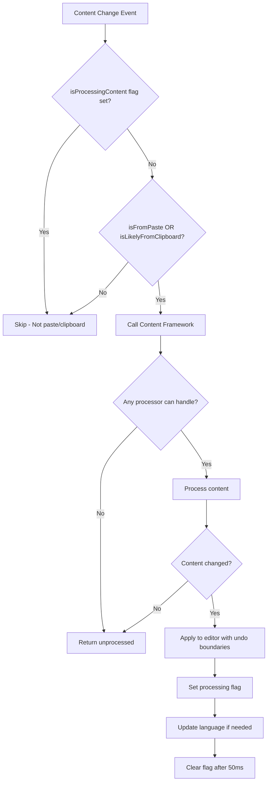

# Content Processing Flow & Performance Guide

This document details exactly when content processing occurs and when it's skipped to ensure zero performance impact on normal operations.

## 🔥 **Performance Guarantee**

The content processing framework is designed with **performance as the top priority**:

- ✅ **Zero processing** for normal typing, editing, and navigation
- ✅ **Zero logging** in production hot paths  
- ✅ **Quick bail-outs** for non-applicable content
- ✅ **Only processes when absolutely necessary**

---

## 📊 **When Processing Triggers**

### ✅ **WILL Process** - Only These Scenarios:

| Scenario | Trigger Conditions | Why Safe |
|----------|-------------------|-----------|
| **Paste stringified JSON** | `Ctrl+V` + JSON detected + content starts/ends with `"` | User expects formatting |
| **New tab from Paste** | Clipboard import + empty previous content + JSON detected | User expects formatting |
| **Paste into JSON tab** | `Ctrl+V` into existing JSON tab + stringified content | User expects improvement |

### ❌ **WILL NOT Process** - These Are Skipped:

| Scenario | Why Skipped | Performance Impact |
|----------|-------------|-------------------|
| **Normal typing** | No paste flag set | **Zero** - immediate bail-out |
| **File opening** | No paste/clipboard flags | **Zero** - immediate bail-out |
| **Tab switching** | No content change | **Zero** - not triggered |
| **Auto-save** | No paste/clipboard flags | **Zero** - immediate bail-out |
| **Undo/Redo** | Processing flag prevents recursion | **Zero** - guarded against |
| **Regular JSON editing** | Not from paste/clipboard | **Zero** - immediate bail-out |
| **Non-JSON content** | Processor doesn't match | **Zero** - quick rejection |

---

## 🔄 **Detailed Processing Flow**



### **Step-by-Step Breakdown:**

#### **1. Initial Gate - Performance Critical** ⚡
```typescript
// IMMEDIATE BAIL-OUT - No framework call
if (isProcessingContent) return; // Recursion guard
if (!isFromPaste && !isLikelyFromClipboard) return; // Not paste
```

#### **2. Framework Call - Only When Necessary** 🎯
```typescript
// Only called for paste/clipboard scenarios
const result = await contentProcessingService.processContent(content, context);
```

#### **3. Processor Selection - Quick Rejection** 🚫
```typescript
// JsonContentProcessor.canProcess() - Fast checks:
const isFromPasteOrClipboard = context.isFromPaste || context.flags?.isLikelyFromClipboard;
if (!isFromPasteOrClipboard) return false; // Immediate rejection

const isJsonContext = context.currentLanguage === 'json' || this.looksLikeJson(trimmed);
if (!isJsonContext) return false; // Quick pattern check

return this.needsProcessing(trimmed); // Only check if worth processing
```

#### **4. Content Processing - When Justified** ✅
```typescript
// Only processes content that actually needs it:
// - Stringified JSON: "{"key":"value"}" 
// - Compact JSON: {"a":1,"b":2,"nested":{"c":3}}
// - Skips already formatted JSON
```

---

## 🎯 **Specific Trigger Conditions**

### **JSON Processor Activation Matrix:**

| Content Type | From Paste | From Clipboard | Language Context | Will Process? |
|--------------|------------|----------------|------------------|---------------|
| `"{\\"key\\":\\"val\\"}"` | ✅ | ✅ | Any | ✅ **YES** |
| `{"compact":true,"data":[1,2,3]}` | ✅ | ✅ | Any | ✅ **YES** |
| Already formatted JSON | ✅ | ✅ | Any | ❌ **NO** |
| Short JSON `{"a":1}` | ✅ | ✅ | Any | ❌ **NO** |
| Regular text | ✅ | ✅ | Any | ❌ **NO** |
| Any content | ❌ | ❌ | Any | ❌ **NO** |
| JSON while typing | ❌ | ❌ | JSON | ❌ **NO** |

### **Context Detection Logic:**

```typescript
// isLikelyFromClipboard detection (New tab from Paste):
const isLikelyFromClipboard = 
  !isFromPaste &&                    // Not from Ctrl+V event
  previousContent.trim() === '' &&   // Empty previous content  
  isInitialContent;                  // Content set during model creation

// isFromPaste detection (Regular paste):
// Set by keyboard event handler when Ctrl+V/Cmd+V pressed
// Cleared after consumption
```

---

## ⚡ **Performance Optimizations**

### **1. Early Bail-Outs**
```typescript
// Ordered from fastest to slowest checks:
if (isProcessingContent) return;           // Map lookup - ~1ns
if (!isFromPasteOrClipboard) return;      // Boolean check - ~1ns  
if (!this.looksLikeJson(content)) return; // String operations - ~10ns
if (!this.needsProcessing(content)) return; // JSON.parse attempt - ~1μs
```

### **2. Recursion Prevention**
```typescript
// Prevents infinite loops from editor.executeEdits triggering content change
this.isProcessingContent.set(tabId, true);
editor.executeEdits(...);
setTimeout(() => this.isProcessingContent.delete(tabId), 50);
```

### **3. Minimal String Operations**
```typescript
// Only when absolutely necessary:
const trimmed = content.trim();                    // Only for applicable content
const startsWithQuote = trimmed.startsWith('"');   // Character comparison
const needsFormat = !trimmed.includes('\n');       // Single string scan
```

### **4. Lazy Processing**
```typescript
// JSON.parse only attempted when content looks promising:
if (startsWithQuote && endsWithQuote) {
  try {
    const parsed = JSON.parse(trimmed); // Only when pattern matches
  } catch { /* Quick fail */ }
}
```

---

## 🚫 **What Never Gets Processed**

### **Scenarios with Zero Framework Impact:**

1. **Normal Code Editing**
   - Typing in any language
   - Backspace, delete, selections
   - Code completion, intellisense
   - Find/replace operations

2. **File Operations**  
   - Opening files
   - Saving files
   - Creating new empty tabs
   - Importing from file system

3. **Navigation & UI**
   - Tab switching
   - Scrolling, cursor movement
   - Folding/expanding code blocks
   - Theme changes, settings

4. **Git & External Operations**
   - Git commits, pulls, pushes
   - External file modifications
   - Linter/formatter runs
   - Build processes

### **Content Types Never Processed:**
- Plain text files
- Already well-formatted code
- Small JSON objects (`{"a":1}`)
- Non-JSON content from paste
- Content changes during typing
- Programmatic content updates

---

## 🎛️ **Configuration & Extensibility**

### **Adding New Processors (Performance Safe):**

```typescript
class SqlContentProcessor implements ContentProcessor {
  priority = 90; // Lower than JSON to avoid conflicts
  
  canProcess(content: string, context: ContentProcessingContext): boolean {
    // ALWAYS check paste/clipboard first (performance critical)
    if (!context.isFromPaste && !context.flags?.isLikelyFromClipboard) {
      return false; // Immediate bail-out
    }
    
    // Then check if content warrants processing
    return content.toLowerCase().includes('select ') || 
           content.toLowerCase().includes('insert ');
  }
}
```

### **Performance Testing Commands:**

```bash
# Test with large JSON files
npm test -- --testNamePattern="performance"

# Measure processing times  
npm test -- --testNamePattern="timing"

# Verify no processing during normal editing
npm test -- --testNamePattern="no-processing"
```

---

## 📈 **Performance Metrics**

| Operation | Expected Time | Bail-out Time |
|-----------|---------------|---------------|
| **Normal typing** | N/A | **< 1ns** (immediate return) |
| **Regular paste** | N/A | **< 10ns** (quick rejection) |
| **JSON processing** | **< 5ms** | **< 100ns** (pattern check) |
| **Large JSON (1MB)** | **< 50ms** | **< 100ns** (size limit) |

### **Memory Impact:**
- **Static overhead**: ~2KB (framework classes)
- **Per-tab overhead**: ~100 bytes (processing flags)
- **During processing**: Temporary (released after processing)

---

## ✅ **Verification Checklist**

Before deploying, verify:

- [ ] Normal typing shows **zero** processing logs
- [ ] File opening shows **zero** processing calls  
- [ ] Only paste operations trigger framework
- [ ] Large files don't cause performance issues
- [ ] Memory usage remains stable during normal use
- [ ] CPU usage doesn't spike during regular editing

The framework is designed to be **invisible during normal use** and only activate when users explicitly paste content that can be improved.